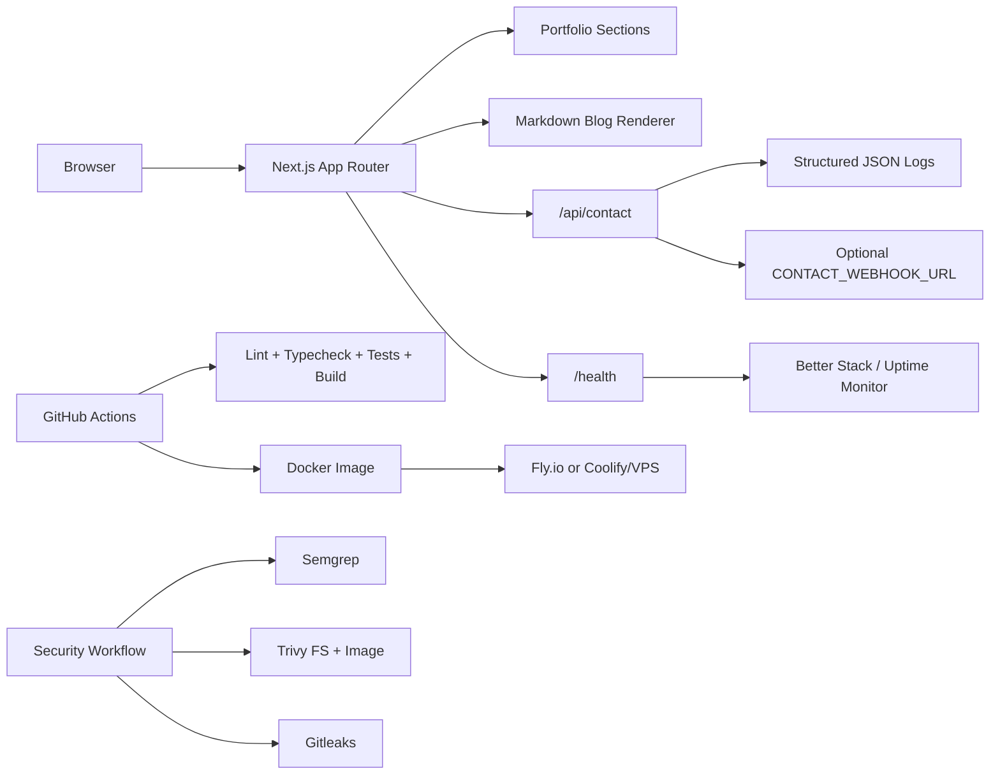

# Computer Engineering Portfolio + DevOps Deployment

Production-ready personal portfolio for a computer engineering student. The site is built with Next.js, TypeScript, Tailwind CSS, Docker, CI/CD, health checks, security scanning, deployment docs, and monitoring notes.

Student: Abdulrahman Ali  
Student number: 23080410313

> Replace the sample profile in `data/profile.ts` before publishing.

## Live and Repository

- Live URL: `https://your-domain.example`
- Repository URL: `https://github.com/<owner>/<repo>`
- CI badge: replace `<owner>/<repo>` after pushing to GitHub:
  ```md
  [](https://github.com/<owner>/<repo>/actions/workflows/ci.yml)
  [](https://github.com/<owner>/<repo>/actions/workflows/security.yml)
  ```

## Tech Stack

- Next.js 16 App Router
- TypeScript
- Tailwind CSS
- ESLint and Prettier
- Vitest
- Docker multi-stage production image
- GitHub Actions CI/CD
- Semgrep, Trivy, and Gitleaks security gates

## Features

- Hero, projects, skills, experience, education, hobbies, and contact sections
- Central editable data file: `data/profile.ts`
- Responsive layout with dark mode toggle
- Contact form API route with validation and honeypot spam protection
- Markdown blog notes in `content/blog`
- Custom 404 page
- Open Graph image route
- SEO metadata, sitemap, and robots.txt
- `/health` and `/api/health` JSON endpoints
- Structured JSON logs for server routes and requests
- Docker Compose for local production testing
- Fly.io and Coolify/VPS deployment docs
- Better Stack uptime monitoring docs

## Architecture



## Local Development

```bash
npm install
cp .env.example .env
npm run dev
```

Open:

```text
http://localhost:3000
```

Quality commands:

```bash
npm run lint
npm run typecheck
npm test
npm run build
npm run format
```

## Docker Usage

The project uses the standalone Next.js production server instead of Nginx. No custom server is required; the container receives normal `SIGTERM` shutdown from Docker, Fly.io, or Coolify.

Build and run with Compose:

```bash
cp .env.example .env
docker compose up --build
```

Test the health endpoint:

```bash
curl http://localhost:3000/health
```

Stop:

```bash
docker compose down
```

Manual image test:

```bash
docker build -t portfolio-nextjs:local .
docker run --rm -p 3000:3000 --env-file .env portfolio-nextjs:local
```

## CI/CD

`.github/workflows/ci.yml` runs:

- checkout
- Node.js 22 setup with npm cache
- `npm ci`
- lint
- typecheck
- tests
- Next.js build
- critical production npm audit
- Docker image build
- GHCR push only on `main`

Image name after GitHub push:

```text
ghcr.io/<owner>/<repo>:latest
```

## Security Gate

`.github/workflows/security.yml` runs:

- Semgrep scan
- Gitleaks secret scan
- Trivy filesystem scan
- Docker image build
- Trivy image scan

Trivy fails the pipeline on CRITICAL vulnerabilities. See `docs/security-testing.md` for safe ways to intentionally trigger failing checks without committing real secrets.

## Deployment

### Fly.io

```bash
fly auth login
fly launch
fly secrets set NEXT_PUBLIC_SITE_URL=https://your-domain.example CONTACT_RECIPIENT=your.email@example.com
fly deploy
fly status
```

Edit `fly.toml` and replace:

```toml
app = "your-unique-portfolio-name"
```

### VPS + Coolify

Use a small VPS such as Hetzner CX22. In Coolify, deploy either from the GitHub repository or from:

```text
ghcr.io/<owner>/<repo>:latest
```

Set internal port `3000`, health path `/health`, and environment variables from `.env.example`. Enable Coolify reverse proxy and SSL for your domain.

More detail: `docs/deployment.md`.

## Custom Domain, SSL, and Lighthouse

Use Cloudflare DNS:

- Fly.io: follow `fly certs add your-domain.example`
- Coolify/VPS: point an `A` record to the VPS IP
- SSL mode: `Full (strict)` after the origin certificate is ready
- Enable HTTPS redirects

Run Lighthouse in Chrome DevTools or:

```bash
npx lighthouse http://localhost:3000 --view
```

Save screenshots for Performance, Accessibility, Best Practices, SEO, tested URL, and timestamp.

## Monitoring

Monitor:

```text
https://your-domain.example/health
```

Recommended setup:

- Better Stack uptime monitor
- Public status page
- Email or Slack alerts
- Container log aggregation through Fly logs, Coolify logs, Better Stack Logtail, or Grafana Loki

More detail: `docs/monitoring.md`.

## Contact Form Setup

The form works without mail credentials by logging a structured delivery event. For production, set:

```text
CONTACT_RECIPIENT=your.email@example.com
CONTACT_WEBHOOK_URL=https://your-trusted-webhook.example
```

The route validates input and uses a hidden `company` honeypot field.

## AI Usage Declaration

This project scaffold and documentation may be generated or assisted by AI. The student is responsible for replacing sample profile content, verifying technical accuracy, running the checks, and explaining every submitted project honestly during review.

## Demo Video Checklist

For a 5-minute unlisted YouTube video:

- Show the live portfolio on desktop and mobile width
- Open `data/profile.ts` and explain how content is edited
- Walk through one project card and its real repository/demo
- Show `/health`
- Run `npm run lint`, `npm run typecheck`, and `npm test`
- Show Docker Compose running
- Open GitHub Actions CI and security workflows
- Explain Fly.io or Coolify deployment path
- Show Better Stack monitor setup or planned monitor
- Mention what was replaced from sample data

## Submission Checklist

- [ ] Replace name, email, GitHub, LinkedIn, domain, and project links
- [ ] Replace `public/cv.pdf` with real CV
- [ ] Replace sample project outcomes with real outcomes
- [ ] Run lint, typecheck, tests, and build
- [ ] Run Docker build and `/health` check
- [ ] Push to GitHub and confirm CI passes
- [ ] Confirm security workflow passes
- [ ] Deploy to Fly.io or Coolify
- [ ] Connect custom domain and SSL
- [ ] Run Lighthouse and save screenshots
- [ ] Record the 5-minute demo video
